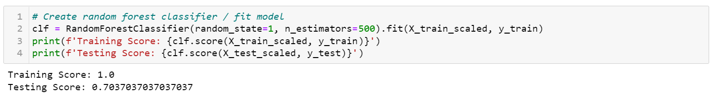
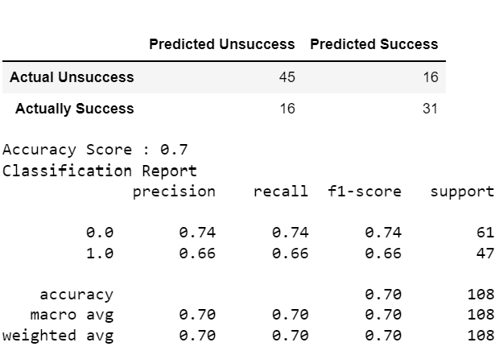

# Beer Characteristics Profiling 

[Click here for the presentation.](https://docs.google.com/presentation/d/1Rn_7RCTm9UO72irvWF4ho0fOMzaHRWQAoMQVw0SUD4k/edit#slide=id.p)

[Click here for the Tableau Public dashboard.](https://public.tableau.com/views/BeerStyleAnalysis/Dashboard2?:language=en-US&:display_count=n&:origin=viz_share_link)

## Overview

The scope of this project is evaluating the flavor profile of successful beers. Since the data analytics program is based in Wisconsin, it seemed like a suitable and fun topic to explore.

The dataset used, Beer Profile and Ratings dataset, is a combination dataset found on Kaggle of two other Kaggle datasets. The first contains flavor profiles of successful beers and the second contains over a million reviews of beers.

The data will be analyzed to understand what factors correlate with a high rating based on data for the beers in the dataset. Our group also intends to investigate how much the appearance of a beer factors into a very positive review. 

## Communication Protocols

Our team will utilize a variety of tools for the duration of the project. Github is the resource for filesharing and collaborating on code. A group calendar has been created with Google Calendar to schedule meetings outside of class. Trello is helping to manage tasks and expectations for the deliverables of each milestone in the project. Slack is being used for messaging between teammates and arranging calls. 

## Dashboard

The project's visualization will be created using Tableau. The interactive elements under consideration are filtering and highlighting data by style and review score between visualizations.

## Machine Learning Model

#### Model Choice 

A supervised machine learning model was chosen as the ideal approach for the analysis. Our team implemented a random forest algorithm for the following reasons:
* It will be useful in reducing likelihood of overfitting
* It can manage many inputs
* It can rank the features easily

The classification model should effectively return the most important characteristics for predicting a popular beer.

#### Data Preprocessing

##### Feature Selection and Engineering 

After reading in the data and examining the features, some features were filtered while unnecessary features were dropped. 

A correlation plot was created to understand the relationship between number of reviews and overall reviews.

To avoid having the analysis skewed by beers with only a few reviews, the dataframe was refined to include only beers with a number of reviews in the upper quartile. There is evidently more noise towards the lower end of number of reviews and an even distribution across the y-axis. This makes sense, since beers with less reviews will be tend to be more volatile. To avoid having the analysis skewed by beers with only a few reviews, the dataframe was refined to include only beers with a number of reviews greater than or equal to 500. This is an observable point on the plot that captures a fair amount of data points while isolating data points that could compromise the integrity of the model's output. 

The target variable, the overall review, was separated into binary values. Our team has determined that a successful beer will have a rating greater than or equal to a 4 star review. If it meets this criterion it is classified as a 1, else it is classified as a 0. 

##### Training and Testing 

The X variable was defined as all of the attributes, such as bitter, sour, hoppy, etc. The target, the Y variable, was set as the overall rating for a beer. A training and testing set was created for both variables. They were scaled and fit to a random forest classifier model to then return training and testing scores. The features were ranked by importance and plotted. Feature selection from the sklearn library was used to choose the important attributes which replaced the original X variable set and fed back into the model to return new scores.  

#### Analysis 

##### Changes in Model Choice

No changes were made in the entirety of the model, but pieces were refined as the understanding of the dataset has increased. One of the major adjustments made in the model since the Segment 2 deliverable was the plot made to see the distribution of ratings to reviews. This altered the decision about the amount of data inserted into the model. The features represented in the feature selection and the accuracy score have both changed. When the random forest classifier model is fit, the training score is a 1.0 and the testing score is 0.72. However, after the model is fit again using the scaled selected features as X, the testing score drops to 0.64, showing that the model needs more data to perform better. 

The first model has proven that it functions well and can classify with decent accuracy. Originally, when the number of reviews was unfiltered for the model, the model performed better at a testing score of 0.76. Looking at the scatter plot for reviews, this makes sense since the data with less reviews appear more at extremes and clear points further away from the boundary line drawn at 4 stars. Cutting those out means the model is forced to reconcile the data closer to the red boundary line and it struggles a bit more. 

##### Confusion Matrix and Accuracy Score

## Additional Training

The next steps will involve analyzing specific beer styles now. The model will be recreated but using a dataset filtered to a certain beer style to see how well that style can be classified. 
